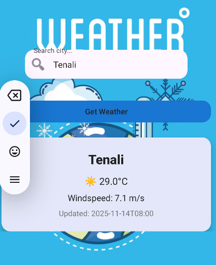

# 🌦️ Android Weather App

An Android Weather Application built using **Java**, **Retrofit**, **Open-Meteo API**, and **OpenStreetMap**, providing real-time weather updates through a clean, animated UI with adaptive light/dark mode.

## 🚀 Features

- Real-time Weather Updates using Open-Meteo API
- Interactive Map Integration with OpenStreetMap
- Modern UI with:
  - Animated weather cards
  - Adaptive light & dark themes
- Location-based Forecast
- Displays:
  - Temperature
  - Humidity
  - Wind Speed
  - Weather Conditions
- Fast API calls using Retrofit
- Error handling for network/API failures

## 🛠️ Tech Stack

| Component | Technology |
|----------|------------|
| Language | Java |
| Networking | Retrofit |
| Weather API | Open-Meteo API |
| Maps | OpenStreetMap |
| JSON Parsing | Gson |
| UI | XML + Material Design |

## 📡 APIs Used

### Open-Meteo Weather API
Provides real-time and forecast weather data.  
Docs: https://open-meteo.com/

### OpenStreetMap
Used for map rendering & location visualization.  
Docs: https://www.openstreetmap.org/

## 📸 Screenshots (Add Your Images Here)

  
  


## 📱 Installation & Setup

1. Clone the repository:
   ```bash
   git clone https://github.com/MLSBHARGAVASAI/Android-Weather-App.git
